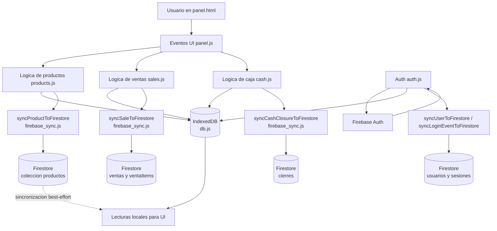

# Diagrama de flujo de datos (kioscoStock)

Este grafico resume como se mueven los datos entre UI, IndexedDB y Firebase.

## Notas clave

- Para productos, primero se guarda en IndexedDB (`putProduct`) y luego se intenta sincronizar a Firestore.
- Si falla Firebase, el dato local queda guardado (`safeSync` captura error y devuelve `false`).
- Actualmente no hay un "pull" automatico de productos desde Firestore hacia IndexedDB en el frontend.

